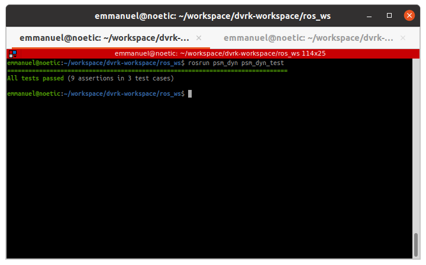

## Description:
This repo contains the implementation of concepts learnt in RBE501 - Robot Dynamics.
 
This code computes the FK and IK for PSM using the screw axis theory.
 
The work is still in progress and the present progress is explained below:

 
 
Here's a quick description of each classes in the folder: "src/psm_dyn/src/"  
- src/psm_dyn/src/psm_kinematics.cpp        --> The class defined in this file is responsible for computing the FK and IK of any given serial manipulator using the screw axis theory.
- src/psm_dyn/src/psm_ros_client.cpp        --> The class defined in this file is responsible for communicating with ambf_client to view our outputs on the simulator.
- src/psm_dyn/src/utils_screw_theory.cpp    --> The class defined in this file contains general helper functions useful to compute FK and IK. For example, functions to convert a given axis and rotation angle into rotation matrix using the Rodriguez Formula. Many more helper functions to be added soon.
 
All the above code has been compiled into a library. This is further tested using the Catch2 framework.

 
 
Here's a quick description of how unit tests are organized in the folder: "src/psm_dyn/test"  
- src/psm_dyn/test/catch2_main.cpp              --> The main function used to trigger all test cases in this folder
- src/psm_dyn/test/test_psm_fk.cpp              --> The testcases for testing kinematic computations carried out in "psm_kinematics.cpp"
- src/psm_dyn/test/test_utils_screw_theory.cpp  --> The testcases for testing the general helper functions in the "utils_screw_theory.cpp"
 

## Output:

 
The verbose of the output is attached as "output.log."

 
 
Thank you for taking time to look into this work.
